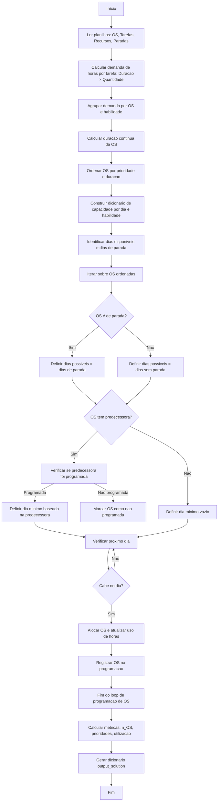

# Documentação Técnica — Sistema de Programação de Ordens de Serviço (OS)

## 1. Visão Geral

Este documento apresenta a estrutura lógica e funcional do algoritmo responsável pela programação semanal de Ordens de Serviço (OS). A função `create_solution()` realiza a alocação automática das OS baseando-se em critérios operacionais, prioridades e disponibilidade de recursos.

A solução proposta considera os seguintes elementos:

* Prioridade das OS (Z, A, B, C)
* Condição de execução (Operando / Parada)
* Dependência entre OS (Predecessoras)
* Capacidade disponível por habilidade e por dia
* Métricas finais de execução e utilização

O resultado final retorna um dicionário contendo:

* O dia programado de cada OS
* Contagens agregadas por prioridade
* Utilização percentual dos recursos disponíveis

---

## 2. Funções Auxiliares

### 2.1 `extrair_num_do_dia(nome_dia: str)`

```python
def extrair_num_do_dia(nome_dia: str) -> int:
    '''
    Retorna apenas o número do dia a partir de uma string no formato "Dia_X".
    Caso não seja possível, retorna False.
    '''
    try:
        partes = str(nome_dia).split("_")
        numero = int(partes[-1])
        return numero
    except:
        return False
```

A função converte rótulos de dia do Excel para valores inteiros, permitindo comparações diretas nas validações de predecessoras e sequenciamento de execução.

### 2.2 `tem_predecessora(predecessora)`

```python
def tem_predecessora(predecessora) -> bool:
    '''
    Verifica se uma OS possui uma predecessora válida.
    Valores vazios ou NaN indicam ausência de predecessora.
    '''
    if pd.isna(predecessora):
        return False
    if isinstance(predecessora, str) and predecessora.strip() == "":
        return False
    return True
```

Evita que células vazias sejam interpretadas como dependências válidas, o que resultaria em OS marcadas incorretamente como não programáveis.

---

## 3. Leitura dos Dados do Excel

```python
os_df = pd.read_excel(excel_path, sheet_name="OS")
tarefas_df = pd.read_excel(excel_path, sheet_name="Tarefas")
recursos_df = pd.read_excel(excel_path, sheet_name="Recursos")
paradas_df = pd.read_excel(excel_path, sheet_name="Paradas")
```

As planilhas trazem informações essenciais sobre as OS, suas tarefas, capacidades de recursos e dias de parada.

---

## 4. Cálculo da Demanda de Horas por OS

### 4.1 Demanda por Tarefa

```python
tarefas_df["Demanda_horas"] = tarefas_df["Duração"] * tarefas_df["Quantidade"]
```

Cada tarefa possui uma duração e quantidade de execução. O produto desses valores define a demanda horária.

### 4.2 Consolidação por OS e Habilidade

```python
demanda_os_hab_df = tarefas_df.groupby(["OS", "Habilidade"])["Demanda_horas"].sum().reset_index()
```

Permite visualizar quantas horas de cada habilidade uma OS necessita ao longo de sua execução.

### 4.3 Transformação em Estrutura de Acesso Rápido

```python
demanda_por_os = {}
for linha in demanda_os_hab_df.itertuples():
    os_id = linha.OS
    habilidade = linha.Habilidade
    horas = linha.Demanda_horas
    demanda_por_os.setdefault(os_id, {})[habilidade] = horas
```

Essa estrutura otimiza o acesso durante o loop principal da programação.

---

## 5. Priorização e Ordenação das OS

As OS são ordenadas de acordo com dois critérios:

1. Prioridade (Z > A > B > C)
2. Menor duração contínua dentro da mesma categoria

Isso garante que OS críticas e rápidas sejam priorizadas.

---

## 6. Capacidade de Recursos

```python
capacidade[(dia, habilidade)] = horas_disponiveis
```

Cada recurso possui uma quantidade de horas disponíveis por dia. Conforme OS são programadas, essas horas são debitadas em `uso[(dia, habilidade)]`.

---

## 7. Algoritmo de Programação das OS

O algoritmo percorre as OS previamente ordenadas por prioridade e, para cada uma delas, executa o processo abaixo:

1. Identifica os dias possíveis conforme a condição operacional da OS (Parada ou Operando).
2. Se houver predecessora, verifica se ela já foi programada e restringe os dias a datas posteriores.

3. Para cada dia elegível:
    * Verifica se há capacidade suficiente de todas as habilidades requeridas.
    * Caso o dia atenda às restrições, a OS é alocada.

4. Se nenhum dia satisfizer os critérios, a OS é marcada como não programável.


## 8. Fluxograma UML do Algoritmo

O diagrama abaixo representa o fluxo lógico completo executado pelo algoritmo de programação de Ordens de Serviço. Ele demonstra, em sequência, as operações realizadas, os pontos de decisão e a relação entre cálculo de demanda, restrições operacionais e alocação de OS.


---

## 9. Métricas Finais

O sistema calcula automaticamente:

* Total de OS programadas
* Quantidade executada por prioridade
* Percentual de utilização de cada habilidade disponível

Essas informações permitem avaliar o desempenho do planejamento e a eficiência no uso da mão-de-obra.

---

## 10. Conclusão

O algoritmo implementado fornece uma solução robusta e determinística para a programação de Ordens de Serviço dentro de um ambiente de restrições reais, garantindo a execução das atividades mais relevantes primeiro, respeitando dependências técnicas e sem ultrapassar capacidades operacionais.

A arquitetura adotada permite expansões futuras, incluindo simulações de cenários, reprogramações dinâmicas e integração com sistemas externos.


Além do diagrama em Mermaid, o fluxograma também foi gerado como imagem PNG para uso em relatórios, apresentações ou anexos de documentação:


